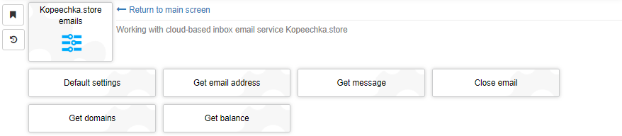
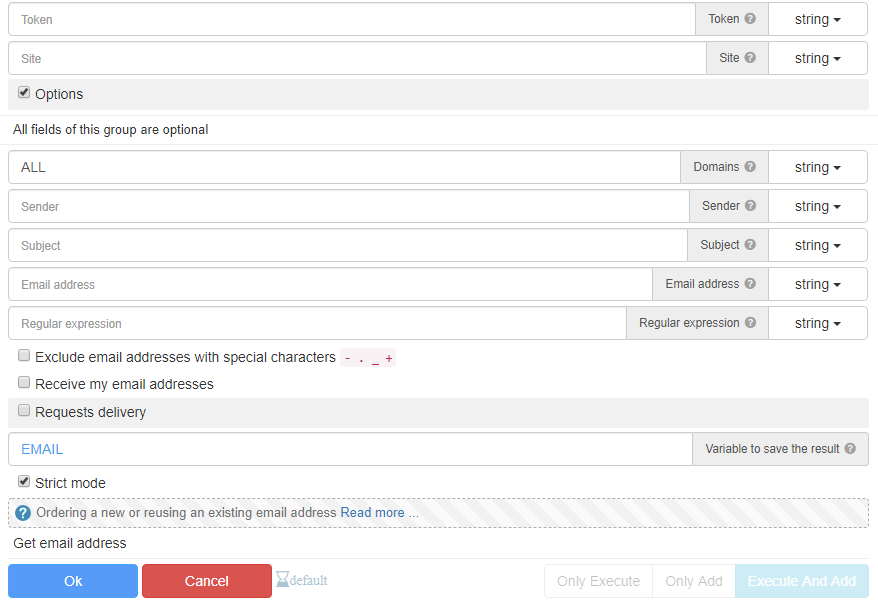
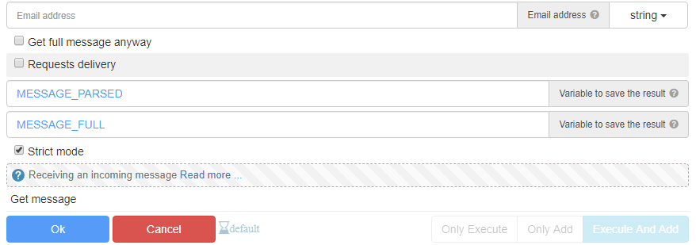
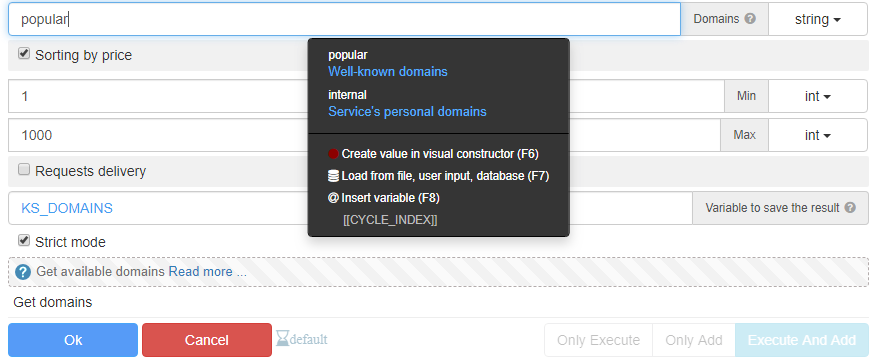
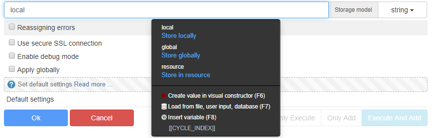
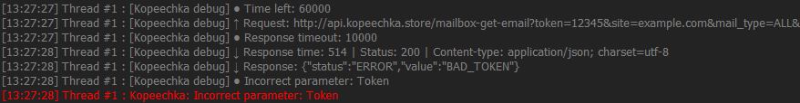

# KopeechkaS

A JavaScript wrapper and GUI for [Browser Automation Studio](https://bablosoft.com/shop/BrowserAutomationStudio) around the [kopeechka.store](https://sites.google.com/view/kopeechka-store-knowledgebase/eng/api-documentation/%D0%BF%D0%BE%D1%87%D1%82%D0%BE%D0%B2%D1%8B%D0%B5-%D0%B0%D0%BA%D1%82%D0%B8%D0%B2%D0%B0%D1%86%D0%B8%D0%B8-eng?authuser=0) api.

Cloud-based service for incoming email messages.

-   Huge bank of trusted email domains (gmail.com, hotmail.\*, outlook.\*, mail.com, etc.)
-   Minimal risk of blocking
-   Fast integration

# Installation

1. Download the latest version of [KopeechkaS](https://community.bablosoft.com/topic/19063/kopeechkas-wrapper-around-kopeechka-store-api) or clone this repository and zip it.
2. Don't unzip the file. Browser Automation Studio requires modules in zip format.
3. Go to Browser Automation Studio and click to Module Manager -> Install module.
4. Choose KopeechkaS.zip and click Open.

# Features

-   Get email address - https://bit.ly/3myvFtt, https://bit.ly/3Hge6WV
-   Get message - https://bit.ly/3JjSdI2
-   Close email - https://bit.ly/3JjY9Rq
-   Get domains - https://bit.ly/3eqIcuu, https://bit.ly/3pqMkkA
-   Get balance - https://bit.ly/3JfllQR

## User-friendly interface

Clear and intuitive, there are descriptions and examples.

## Using the same email in multiple threads

All emails data is stored in RAM, you can choose the storage model: `local`, `global`, `resource`.

`local` - Store locally. This threads emails will not be available to other threads.

`global` - Store globally. All threads can access any email data in this storage.

`resource` - Store in resource. Same as global model, but a bit slower.

Storage models `global` and `resource` cannot be cleared automatically. To avoid memory leaks, it is necessary to close the email.
The `local` storage model is cleared automatically when the thread ends.

## The code is designed to keep error rates to minimum

Several categories of errors are present: `common`, `fatal`, `ignored`.
Behavior can be reassigned, each error has its own ID.

`Common` errors - if they occur, the `Fail` action is called.

`Fatal` errors - if they occur, the `End Script` action is called.

`Ignored` errors are ignored.

## Built-in debugger

Informative and clear.
Shows queries sent, time metrics in ms, errors text, etc.

# More

[Official topic](https://community.bablosoft.com/topic/19063/kopeechkas-wrapper-around-kopeechka-store-api) on the Browser Automation Studio forum.

<<<<<<< HEAD
=======
[My referral link](https://kopeechka.store/?ref=1232) of Kopeechka.store.

>>>>>>> cba2f92472a3fd17382d05ee88d008d8ba34cb01
# Suggestions

If you have any questions or suggestions, please contact me:

-   Email: mail.to.sadzurami@gmail.com
